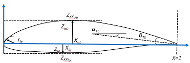
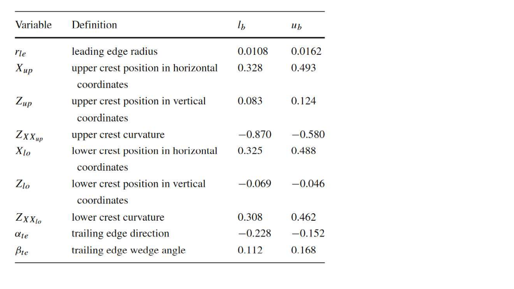
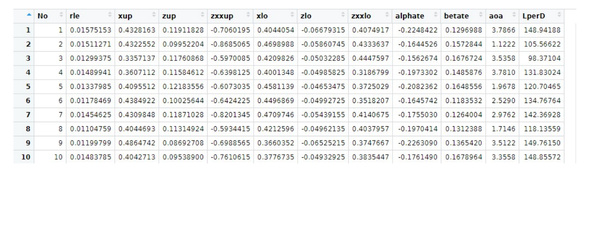
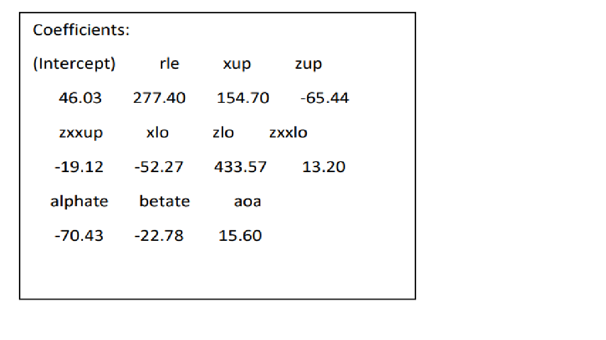

## Introduction

This project aims to perform inferential statistics, specifically
conducting hypothesis testing and regression modelling on a given
specific problem. This project consists of 3 different cases: hypothesis
testing on carbon steels' modulus of elasticity, hypothesis testing on
mixtures' resistance value, and regression modelling on airfoil
performance.

## Case 1 : Hypothesis Testing on Carbon Steels

#### **Problem:** 

A Mechanical Engineering student conducts a test to see the effect of
carbon in steel on the modulus of elasticity. The student prepared two
samples, namely samples A and B. Sample A contained 0.2% Carbon and
sample B contained 0.4% Carbon. After the two samples were successfully
manufactured, the student performed a tensile test to obtain a
stress-strain curve. The modulus of elasticity could be calculated using
this curve. Tensile tests were performed 100 times for both sample A and
sample B. The modulus of elasticity data for both samples can be seen in
the "Dataset_NIM_13120108_1.csv" file (has been cleaned), where the first column is for
sample A and the second column is for sample B. Using R, please test the following hypothesis using the value of $\alpha = 0.05$\

1. Is the modulus of elasticity of sample A E = 210 GPa?\
2. Determine whether there is an effect of carbon content on the modulus
of elasticity of samples A and B.

#### **Code:** 

```{r}
# Read CSV file
DF <- read.csv('Dataset_NIM_13120108_1.csv', header=FALSE)
# Change the data frame header to 'A' and 'B'
colnames(DF) <- c('A','B')
# Question 1
DF_A <- DF[,1]
DF_B <- DF[,2]
tresulta <- t.test(DF_A, mu = 210, alternative="two.sided")
print(tresulta)
# Question 2
tresultb <- t.test(DF_A,DF_B, mu = 0, alternative="greater", var.equal=TRUE)
print(tresultb)
```
#### **Analysis:**\

1. Since we do not have the information of the data variance, then we will use t-test to perform the hypothesis testing. From the first output we can obtain the p-value for the hypothesis which is 0.3966. Since 
the null hypothesis (H~0~) for the t-test is that 𝜇~0𝐴~ = 210, and the p-value is greater than 
𝛼 (0.05), thus we can conclude that we fail to reject H~0~. It means that the modulus of 
elasticity of sample A is 210 GPa.\

2. To determine whether there is an effect of carbon content on the modulus of elasticity, 
we can use hypothesis testing on the mean difference of both sample A and B. We set 
the H~0~ as $𝜇_{0A} = 𝜇_{0B} → 𝜇_{0A} − 𝜇_{0B} = 0$. In the other hand, the alternative hypothesis 
(H~1~) as $𝜇_{0A} > 𝜇_{0B} → 𝜇_{0A} − 𝜇_{0B} > 0$. From the second output, we can obtain the p-value 
which is 0.8629 which is higher than the 𝛼 value, so we fail to reject H~0~. This means 
that both sample A and sample B has the same mean value, so we can say that there is 
no effect of carbon content on the modulus of elasticity.


## Case 2: Hypothesis Testing in Various Mixtures

#### **Problem:**\
A mechanical engineering student is trying to compare the resistance of a mixture between 
carbon black and silicone. The student mixed and compared the resistance values of 5 mixtures: 
5 %, 7.5%, 10%, 12.5%, and 15% carbon black by weight. The student then measured the 
resistance using a precision multimeter. The measured value are stored in the "Dataset_NIM_13120108_2.csv" file (has been cleaned). Using R, please test the following hypothesis using $\alpha = 0.01$, does the concentration of the carbon black change the resistance values of the 
mixtures?\

#### **Code:**

```{r}
# Read CSV file
DF2 <- read.csv('Dataset_NIM_13120108_2.csv', header=FALSE)
# Change the data frame header to 'A' and 'B'
colnames(DF2) <- c('5%','7.5%','10%','12.5%','15%')

DF2_1 <- DF2[,1] # carbon black 5%
DF2_2 <- DF2[,2] # carbon black 7.5%
DF2_3 <- DF2[,3] # carbon black 10%
DF2_4 <- DF2[,4] # carbon black 12.5%
DF2_5 <- DF2[,5] # carbon black 15%

tresult1 <- t.test(DF2_1,DF2_2, mu = 0, alternative="less", conf.level=0.99, var.equal=TRUE)
print(tresult1)
tresult2 <- t.test(DF2_2,DF2_3, mu = 0, alternative="less", conf.level=0.99, var.equal=TRUE)
print(tresult2)
tresult3 <- t.test(DF2_3,DF2_4, mu = 0, alternative="less", conf.level=0.99, var.equal=TRUE)
print(tresult3)
tresult4 <- t.test(DF2_4,DF2_5, mu = 0, alternative="less", conf.level=0.99, var.equal=TRUE)
print(tresult4)
```
#### **Analysis:**

To know whether the concentration of carbon black affects the resistance values of each mixture, we have to use the hypothesis testing to compare every two mixtures to see their mean difference. Since the variance of each sample is not given, we will assume all of the mixture have equal variances. If the test shows that each two mixtures have different mean value, then we can say that carbon black does affect the resistance values and vice versa. We set the null hypothesis (H~0~) as $𝜇_1 = 𝜇_2$ for every test, and the alternative hypothesis (H~1~) as $𝜇_1 < 𝜇_2$. The test result can be seen from tresult1 until tresult4, where all of the p-value are smaller than the $\alpha$ value (0.01) thus we reject H~0~. It means that the concentration of the carbon black changes the resistance values of the mixtures. Since the H~1~ is $𝜇_1 < 𝜇_2$, we can say that the higher the concentration of carbon black, the higher the resistance values of the mixtures will be.


## Case 3: Regression Modelling on Airfoil Performance

#### **Problem:**

The performance of a wind turbine significantly depends on the cross-sectional shape of the 
blade (i.e., the airfoil). An excellent airfoil yields high lift-to-drag ratio (i.e., L/D), which 
indicates that the airfoil has high performance in terms of fluid-dynamics efficiency. An 
engineer performed experiments with various shapes of airfoil using computer simulation, 
yielding a data set consisting of 8000 samples, 10 input variables, and one output variable that can be seen in the "subsonic_airfoil_data_set.csv" file. The first nine input variables correspond to the geometry of a subsonic airfoil. The last input variable is the angle of attack (AoA, i.e., the angle between the airfoil 
and the incoming flow), in which the corresponding lower and the upper bound are 0 and 4 
degrees, respectively. The goal is to analyze the input-output relationship, where the output of 
interest is the lift-to-drag ratio (L/D). The L/D was calculated by using a coupled inviscid-viscous solver (i.e., XFOIL) performed at the velocity of roughly 102.9 m/s. 




**Preview of the first 10 data:**


#### **Note:**
We will build a linear regression model using only the subset of 8000 samples. To be exact, we will take 1000 samples out of the 8000 samples randomly. We will denote the new data frame as "XDATA".
```{r}
# Creating 1000 samples
XDATA <- read.csv('subsonic_airfoil_data_set.csv')
set.seed(08) # Set random numbers,
idx <- sample(8000) # Random indexing
nsamp <- 1000 # Number of samples 
Xsub <- XDATA[idx[1:nsamp],]
```

For the future analysis, we will use "Xsub" as our main data frame to create the linear regression model. Based on this data frame, please perform the following task.

1. Build a linear regression model to approximate the given data set. Please also calculate 
the accuracy of the regression models. Is the model accurate enough?
2. Are there any linear relationships between the inputs and the outputs?
3. Please interpret the coefficients of the linear regression model.
4. Which geometrical input variables give the most significant increment of L/D? Why?
5. By interpreting your linear regression model, please describe how we could maximize 
the L/D.

#### **Code:**

```{r}
# Question 1-3
lrmodel = lm(data = Xsub, formula = LperD~rle+xup+zup+zxxup+xlo+zlo+zxxlo+alphate+betate+aoa)
print(lrmodel)
summary(lrmodel)
```

```{r}
# Question 4-5
# Create a function to normalize the inputs data call min_max_norm
min_max_norm <- function(Xsub) {
  for(i in 2:(dim(Xsub)[2]-1)) {
    X <- Xsub[,i]
    Xsub[,i] <- (X-min(X))/(max(X)-min(X))
  }
  return(Xsub)
}
# Create a new data frame name "Xsubnorm" where all of the input data has been normalized
Xsubnorm <- min_max_norm(Xsub)

# Create a new linear regression model
lrmodel2 = lm(data = Xsubnorm, formula = LperD~rle+xup+zup+zxxup+xlo+zlo+zxxlo+alphate+betate+aoa)
print(lrmodel2)
summary(lrmodel2)
```

#### **Analysis:**

1. The linear model can be obtained by arranging the following coefficient of each independent variables:
 The accuracy of the regression models can be obtained through the coefficient of 
determination or R^2^ that we can get from the summary output of the first linear model regression 
, which is 0.9255. Since the R^2^
value is so close to 1, hence we 
can say that the linear regression model is accurate.

2. The relationships between the input and output can be obtained by looking at the p-value for each variable. If the p-value is smaller than 𝛼 (assumed to be 0.05), then the 
variable/input has a linear influence on the output (reject H~0~: 𝛽~0~ = 0) and the 
otherwise. Since from the output shows that the p-value for all inputs are significantly 
smaller than 𝛼 value, so we can conclude that all the inputs are linearly related to the 
output.

3. The coefficient of each variable actually represents the slope or gradient it contributes 
to the output. For instance, if the angle of attack is increased by 1 degree, than the 
output will be increased by 15.6 unit. We can see the input with highest slope is the 
zlo input and the variable with smallest slope is zxxlo. 

4. After all the inputs have been normalized, we can determine the variable that give the 
most significant increment to the output by looking at the value of the coefficient that 
represents its contribution to the output’s gradient. We can see that the geometrical 
input with highest coefficient is X~up~ where the coefficient is 25.4919. The reason why 
we choose for the highest coefficient is because it contributes the biggest gradient 
/increasement to the output. Aside of geometrical inputs, we can also see that angle of 
attack has the biggest impact to the output as it has the biggest coefficient which is 
62.0969.

5. From the explanation on number 4, we can conclude that in order to maximize the L/D,
we can either increase the angle of attack or increase the X~up~ value.